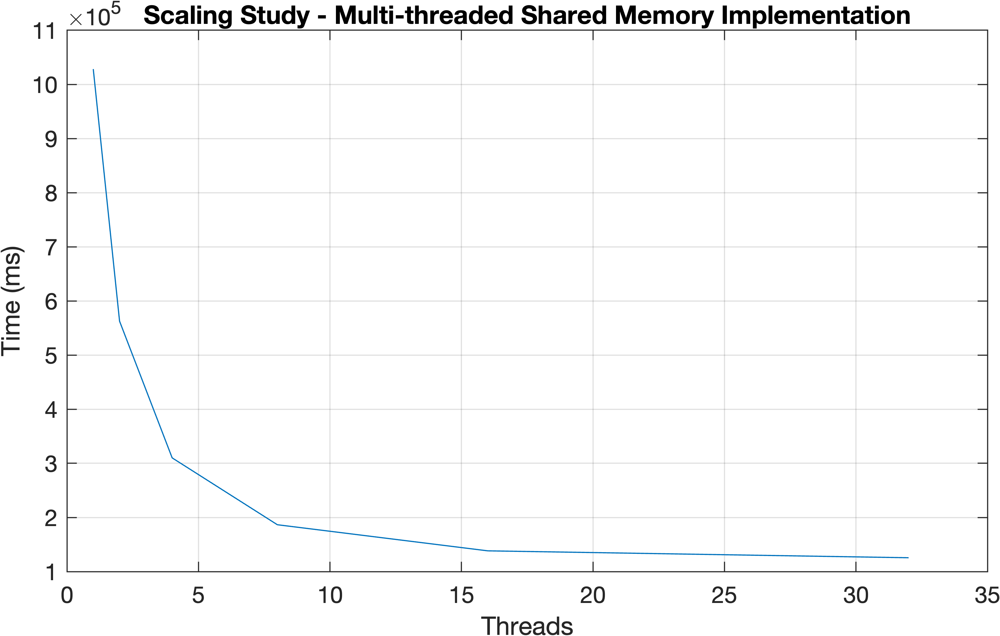
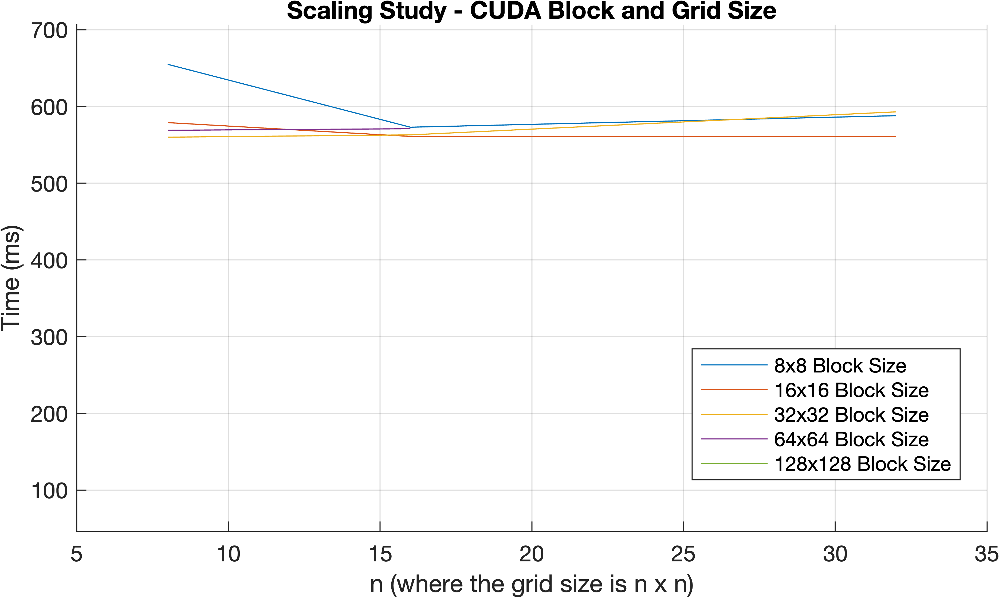
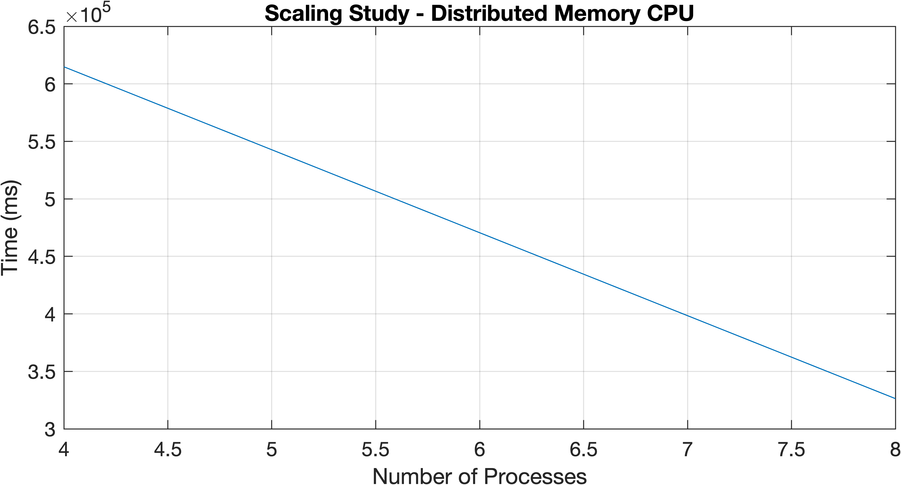

# Scaling Study

Nick Waddoups, Scott Pinkston, Jared Moulton

## Project Description

Given a digital elevation map we compute the number of pixels visible from each pixel in a 100-pixel
radius. This information is then stored in an image format similar to input format, where each pixel
value represents the number of visible pixels that it can see. An example output of this is given
in Figure 1.

## Project Build

See the [README](./README.md) on our Github page for instructions on how to build this project.

## Scaling Results

### Shared Memory Serial vs. Parallel Execution

For this we ran `./build/src/parallel_cpu/par_cpu input.raw output.raw 6000 6000 36 n`, where `n` was the
number of specified threads. We used the `lonepeak` CHPC cluster to do these tests, and we used the
following parameters:

- Nodes: 1
- Tasks: 16

| Threads | Time (ms) |
|:----:|:----------:|
|    1 | 1028290 ms |
|    2 | 562589 ms  |
|    4 | 310068 ms  |
|    8 | 186566 ms  |
|   16 | 138344 ms  |
|   32 | 125590 ms  |

### Single GPU Execution

| Block Size | Grid Size | Time (ms) |
|:---:|:---:|:---:|
| 8x8 | 8x8 | 655 ms|
| 8x8 | 16x16 | 573 ms|
| 8x8 | 32x32 | 588 ms|
| 16x16 | 8x8 | 579 ms|
| 16x16 | 16x16 | 566 ms|
| 16x16 | 32x32 | 561 ms|
| 32x32 | 8x8 | 560 ms|
| 32x32 | 16x16 | 563 ms|
| 32x32 | 32x32 | 593 ms|
| 64x64 | 8x8 | 569 ms|
| 64x64 | 16x16 | 571 ms|
| 128x128 | 8x8 | 577 ms|

### Distributed CPU vs. GPU Execution

| Processes | Time (ms) |
|:---:|:---:|
| 8 |  326303 ms |
| 4 |  614851 ms |

